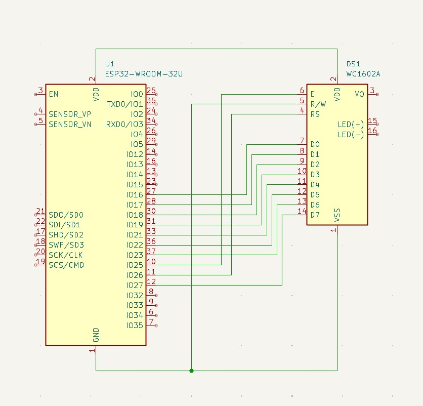

# MonoMosaic

An experimental graphics library sketch for HD44780 16x2 character displays, designed for making graphical user interfaces on these displays possible
## Project Status

This is a work-in-progress testing sketch, not a finished library. It's used for experimentation and validation of ESP32's dual-core capabilities with direct register writes and running the display[...]  

## Purpose

This project explores:  
- Dual-Core Processing - Testing multi-core task distribution on ESP32  
- HD44780 16x2 Display Control - Character display manipulation across cores  
- Pixel Array modification and line drawing algorithms  
- Core Affinity - Testing task pinning and core communication  

## Hardware

  
- ESP32 microcontroller (dual-core)  
- HD44780 16x2 character display module

## Current Features

- Basic HD44780 16x2 display initialization  
- Multi-core task creation and management  
- Display refresh testing across CPU cores  
- Core communication and synchronization primitives

## Usage

Put your graphical commands into core 1. Core 0 is doing its best to just keep up with the screen.

### Available Commands

- **drawPixel(int x, int y)** - Turns on a pixel at the specified coordinates

- **drawLine(int x0, int y0, int x1, int y1)** - Draws a line between two sets of coordinates

- **drawCircle(int centerX, int centerY, int radius)** - Draws a circle outline with the specified center point and radius

- **drawFilledCircle(int centerX, int centerY, int radius)** - Draws a filled circle with the specified center point and radius

- **drawBox(int x1, int y1, int x2, int y2)** - Draws a rectangle outline using two corner coordinates

- **drawFilledBox(int x1, int y1, int x2, int y2)** - Draws a filled rectangle using two corner coordinates

- **drawSquare(int x, int y, int size)** - Draws a square outline at the specified coordinates with the given size

- **drawFilledSquare(int x, int y, int size)** - Draws a filled square at the specified coordinates with the given size

## Notes

- API and functionality are subject to change
- Go crazy wit dis

## Future Development

- [ ] Stabilize core task distribution
- [ ] Optimize inter-core communication
- [ ] Implement efficient display buffering
- [ ] Add comprehensive performance metrics
- [ ] Convert to production-ready library

## Author

TutkunAI - 2026

---

This is a testing/experimental project. Don't Crucify Me!